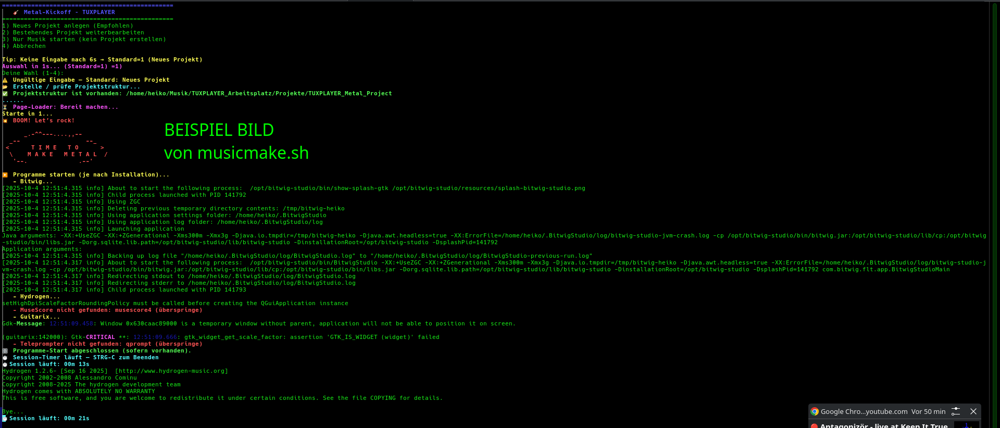
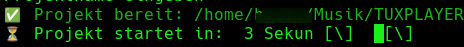

cat > README.md << 'EOF'
# 🎸 MusicMake - Linux Music Production Studio Manager

[](LICENSE)
[](https://www.linux.org/)

> **Session-Management für Linux-Musiker**  
> _TUXPLAYER Edition - Where Code Meets Creativity_ 🎵

---

#✨ Features
🎨 TUXPLAYER-Style Terminal-UI
### TUXPLAYER-Style Terminal-UI


### Automatische Projektstruktur



---
Farbiges, animiertes Interface - Zinker-Effekte und motivierende Texte
BOOM-Countdown - Epischer 5-4-3-2-1 Start für deine Session
Live Session-Timer - Behalte den Überblick über deine Recording-Zeit
### BOOM-Effekt beim Session-Start



📁 Automatische Projektstruktur
Beim Erstellen eines neuen Projekts werden automatisch Ordner angelegt:

Drums/ - Für Drum-Spuren und Patterns
Guitar_Rhythm/ - Rhythmus-Gitarren
Guitar_Lead/ - Lead-Gitarren und Solos
Bass/ - Bass-Aufnahmen
Vocals/ - Gesangs-Tracks
FX_Master/ - Mastering und Effekte
Noten_und_Lyrics/ - MuseScore-Dateien und Liedtexte

🚀 Multi-Programm-Launcher
Starte alle deine Tools mit einem Klick:

Hydrogen - Drum Machine / Pattern Sequencer
Bitwig Studio - Digital Audio Workstation (DAW)
MuseScore - Notensatz und Komposition
Guitarix - Guitar Amp Simulation & Effects
QPWGraph - Audio/MIDI Connection Manager

🎼 MIDI zu LilyPond Konverter
Das mitgelieferte midi2score.py konvertiert deine MIDI-Dateien in professionelle Notenschrift:

Kompatibel mit MuseScore und LilyPond
Automatische Notenerkennung
Einfache Kommandozeilen-Nutzung


📦 Installation
System-Voraussetzungen

Linux (Kernel 4.0+)
Bash 4.0+
Python 3.8+ (für MIDI-Konverter)

Audio-Programme installieren
Arch Linux / Manjaro / CachyOS:
bashsudo pacman -S hydrogen musescore guitarix qpwgraph
yay -S bitwig-studio
Fedora:
bashsudo dnf install hydrogen musescore guitarix qpwgraph
Ubuntu / Debian:
bashsudo apt install hydrogen musescore guitarix qpwgraph
Python-Abhängigkeiten (für MIDI-Konverter)
bashpip install -r requirements.txt

🎮 Verwendung
Neue Session starten
bash./musicmake.sh

Wähle [1] Neue Session starten
Gib einen Projektnamen ein
Warte auf den BOOM-Countdown
Wähle welche Programme gestartet werden sollen
Los geht's!

Bestehendes Projekt öffnen
bash./musicmake.sh

Wähle [2] Bestehendes Projekt öffnen
Wähle dein Projekt aus der Liste
Deine Programme werden im richtigen Ordner gestartet

MIDI konvertieren
bash./midi2score.py mein_song.mid
./midi2score.py mein_song.mid noten.ly
musescore noten.ly
Hilfe anzeigen
bash./musicmake.sh --help
./musicmake.sh --version

📁 Projektstruktur
Nach Erstellung eines neuen Projekts:
~/MusicMake_Projects/
└── Mein_Projekt/
    ├── Drums/
    ├── Guitar_Rhythm/
    ├── Guitar_Lead/
    ├── Bass/
    ├── Vocals/
    ├── FX_Master/
    └── Noten_und_Lyrics/
        ├── MuseScore/
        └── Lyrics/

🐛 Troubleshooting
Programme werden nicht gefunden
bashwhich hydrogen bitwig-studio musescore guitarix qpwgraph
Python mido fehlt
bashpip install mido

🤝 Contributing
Pull Requests sind willkommen!

Fork das Repository
Erstelle einen Feature-Branch
Commit deine Änderungen
Push zum Branch
Öffne einen Pull Request


📜 Lizenz
MIT License
Copyright (c) 2025 TUXPLAYER Community (@Tuxplayers)
Siehe LICENSE für Details.

👥 Credits
Entwickelt von: TUXPLAYER Community
GitHub: @Tuxplayers
Repository: https://github.com/Tuxplayers/musikstudio

Rock on! Keep making music! 🎵🤘
EOF

Danach pushen:
```bash
git add README.md
git commit -m "Update README with detailed documentation"
git push
